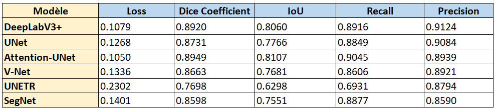
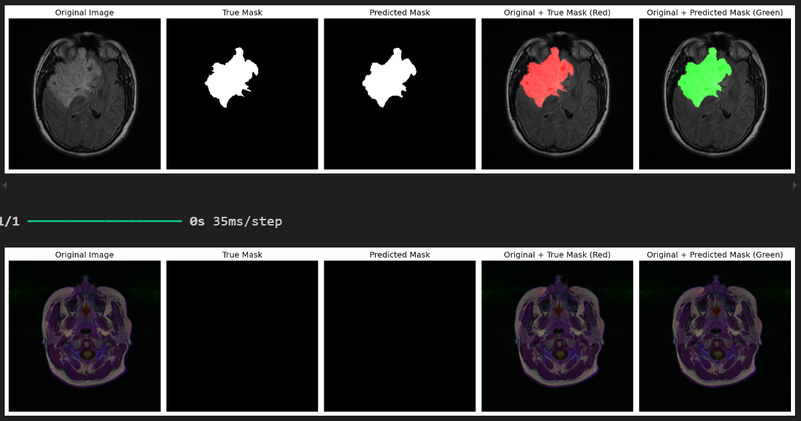
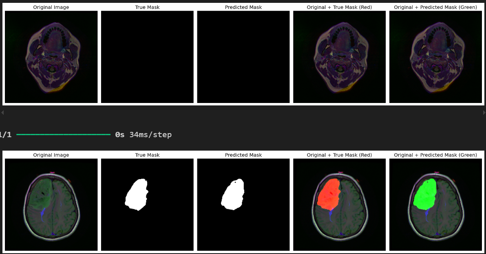

# Brain Tumor Detection & Segmentation 

## Overview

This project focuses on the detection and segmentation of brain tumors from MRI scans using state-of-the-art deep learning architectures. It leverages various semantic segmentation models to provide accurate and efficient tumor detection.

The primary goal is to compare the performance of different models for medical image segmentation tasks and evaluate their efficiency in terms of metrics like Loss, Dice Coefficient, IoU, Recall, and Precision.

## Dataset

The **LGG Segmentation Dataset** contains brain MRI images and manual FLAIR (Fluid-Attenuated Inversion Recovery) abnormality segmentation masks. The data comes from **The Cancer Imaging Archive (TCIA)** and includes images from 110 patients with lower-grade gliomas, part of **The Cancer Genome Atlas (TCGA)** collection.

- **Content**: MRI images with tumor segmentation masks for FLAIR abnormalities.
- **Genomic Data**: Includes genomic subtypes and patient data (available in `data.csv`).
- **Source**: [LGG MRI Segmentation Dataset on Kaggle](https://www.kaggle.com/datasets/mateuszbuda/lgg-mri-segmentation)

For further details, see the following publications:
- "Association of genomic subtypes of lower-grade gliomas with shape features automatically extracted by a deep learning algorithm" (Computers in Biology and Medicine, 2019).
- "Radiogenomics of lower-grade glioma: algorithmically-assessed tumor shape is associated with tumor genomic subtypes" (Journal of Neuro-Oncology, 2017).

## Models Used
- **DeepLabV3+**: Advanced semantic segmentation architecture with Atrous Spatial Pyramid Pooling (ASPP).
- **UNet**: Classic biomedical segmentation model with a U-shaped encoder-decoder structure.
- **Attention-UNet**: Improved UNet with attention mechanisms for focusing on relevant regions.
- **V-Net**: 3D convolution-based architecture designed for volumetric medical images.
- **UNETR**: Combines transformers with UNet for long-range feature learning.
- **SegNet**: Lightweight encoder-decoder model for efficient segmentation.

## Evaluation Metrics
The models are evaluated based on the following:
- **Loss**: Measures model optimization.
- **Dice Coefficient**: Measures overlap between predicted and ground truth.
- **IoU (Intersection over Union)**: Quantifies prediction accuracy.
- **Recall**: Captures sensitivity to tumor detection.
- **Precision**: Indicates the quality of tumor segmentation.

## Results

The results highlight Attention-UNet and DeepLabV3+ as the top-performing models for brain tumor segmentation. Attention-UNet achieved the highest Dice Coefficient (0.8949) and strong Recall (0.9045), excelling in capturing tumor regions. DeepLabV3+, with a Dice Coefficient of 0.8920 and the highest Precision (0.9124), demonstrated superior accuracy in delineating tumor boundaries. These models strike a balance between detection sensitivity and segmentation precision, making them the most effective for this task.

## Visual Results of Segmentation
Below are visual comparisons of brain tumor segmentation results produced by the best-performing models: Attention-UNet and DeepLabV3+.

### Attention-UNet Segmentation Output

The Attention-UNet model accurately detects tumor regions while focusing on important areas, ensuring high recall and precision.

### DeepLabV3+ Segmentation Output

DeepLabV3+ provides precise boundaries for tumor segmentation, demonstrating its robustness in complex cases.

## Contributing

We welcome contributions! Please feel free to submit issues or pull requests. If you have any questions or need support, feel free to reach out. We welcome any contributions that enhance the project's scope and impact.

## License

This project is licensed under the MIT License. See the [LICENSE](LICENSE) file for details.

