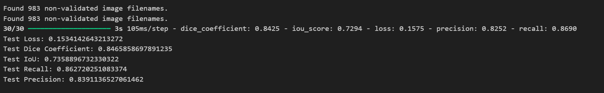
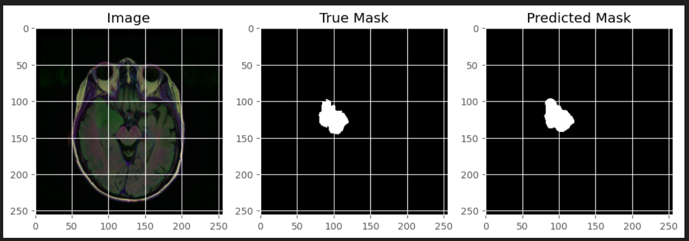
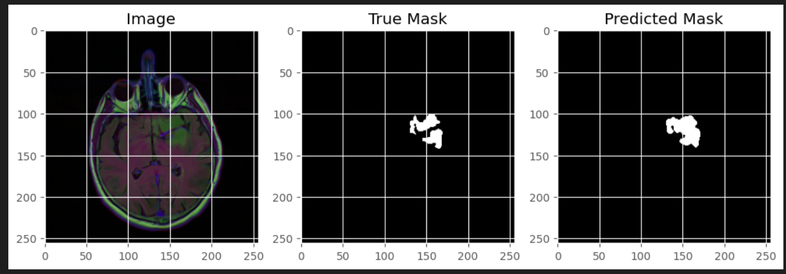
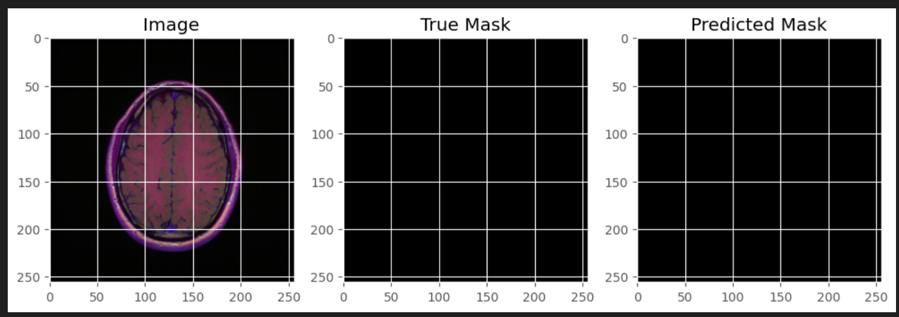
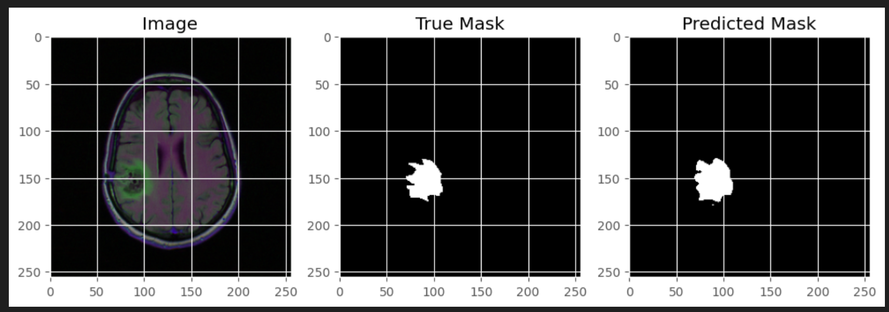

# Brain Tumor Detection & Segmentation 

This project utilizes deep learning techniques for brain tumor segmentation in MRI images. Using a U-Net model implemented in TensorFlow, the goal is to accurately detect and segment brain tumors in medical images.

## Project Overview

This project is aimed at automating the segmentation of brain tumors in MRI scans. The U-Net model, a convolutional neural network designed for image segmentation, is used for this task. The model is trained on a dataset of MRI images with labeled tumor regions, and the goal is to predict tumor regions in unseen MRI images.

## Technologies Used

- **TensorFlow**: For deep learning model development.
- **Keras**: High-level neural networks API, running on top of TensorFlow.
- **NumPy & Pandas**: For data handling and manipulation.
- **Matplotlib**: For visualizations and plotting.
- **OpenCV**: For image processing tasks.
- **scikit-learn**: For model evaluation and metrics.
- **tqdm**: For progress bar during training.

## Dataset

The **LGG Segmentation Dataset** contains brain MRI images and manual FLAIR (Fluid-Attenuated Inversion Recovery) abnormality segmentation masks. The data comes from **The Cancer Imaging Archive (TCIA)** and includes images from 110 patients with lower-grade gliomas, part of **The Cancer Genome Atlas (TCGA)** collection.

- **Content**: MRI images with tumor segmentation masks for FLAIR abnormalities.
- **Genomic Data**: Includes genomic subtypes and patient data (available in `data.csv`).
- **Source**: [LGG MRI Segmentation Dataset on Kaggle](https://www.kaggle.com/datasets/mateuszbuda/lgg-mri-segmentation)

For further details, see the following publications:
- "Association of genomic subtypes of lower-grade gliomas with shape features automatically extracted by a deep learning algorithm" (Computers in Biology and Medicine, 2019).
- "Radiogenomics of lower-grade glioma: algorithmically-assessed tumor shape is associated with tumor genomic subtypes" (Journal of Neuro-Oncology, 2017).

## Model

The core of the project is the U-Net architecture, which is particularly well-suited for biomedical image segmentation tasks. The U-Net model consists of a contracting path to capture context and a symmetric expanding path that enables precise localization.

### U-Net Architecture
- **Encoder**: Multiple convolutional layers followed by max-pooling operations.
- **Bottleneck**: The deepest part of the network, where the features are most compressed.
- **Decoder**: Upsampling and concatenation with encoder features to make precise pixel-wise predictions.

 ## Model Evaluation
The model performance was evaluated on a test dataset using various metrics commonly used for image segmentation tasks. The evaluation metrics, including loss, Dice coefficient, IoU (Intersection over Union), recall, and precision, were computed to assess the effectiveness of the model in segmenting the tumor regions.

The following screenshot shows the evaluation results for the model on the test dataset, including key metrics such as the Dice coefficient, IoU, Recall, Precision, and Test Loss:

## Results
Sample visualizations of predictions vs true masks are displayed after testing, showcasing the model's performance on various MRI images.

## Contributing

We welcome contributions! Please feel free to submit issues or pull requests. If you have any questions or need support, feel free to reach out. We welcome any contributions that enhance the project's scope and impact.

## License

This project is licensed under the MIT License. See the [LICENSE](LICENSE) file for details.

